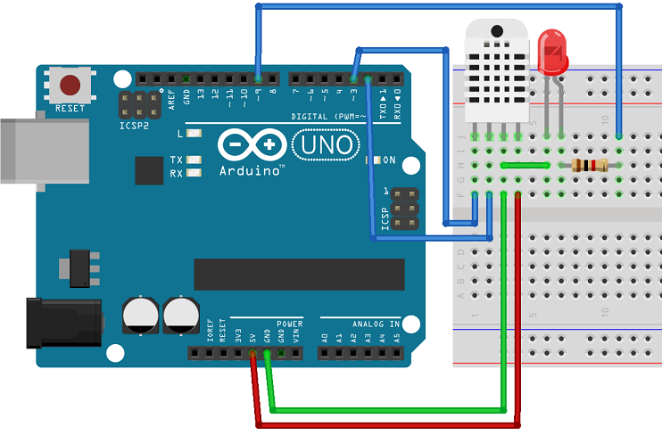
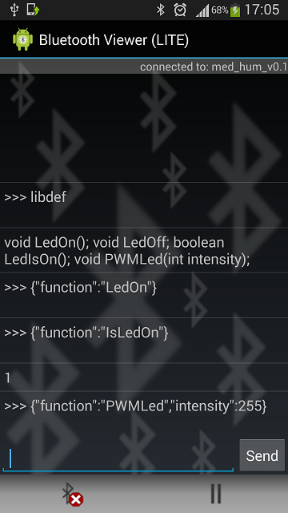

Jsoknit proof of concept
==============

This document describes how to run a Jsoknit proof of concept test. 

To copy the directory structure to your local machine, install git, open a terminal in Linux/OSX or a Git Shell in Windows and type:

``` 
git clone TODO ADD URL
```

Alternatively, download the zip file.

What's in here: 

* A fritzing directory with the Fritzing sketch. This sketch was used to generate the Arduino and breadboard wiring diagram.
* An images directory.
* A jsoknit_proof_of_concept directory with the Arduino sketch, to be uploaded once the breadboard is wired.
* This README.md file.

# What is Jsoknit?

Jsoknit is a JSON based framework used to describe embedded functions such that they may be called from other devices. If an embedded device with a jsoknit interface receives the *libdef* keyword, it then returns the library definition of all functions that may be called. The remote device can then make function calls as defined in the library. In this proof of concept, when an external device sends the libdef keyword to the embedded device, it receives the following reply:

``` 
"void LedOn(); void LedOff; boolean LedIsOn(); void PWMLed(int intensity);"
```

If the external device then sends a string:

``` 
{"function":"LedOn"}
```

The json string is parsed and the LedOn() function is called, turning the led, as shown in the schematic, on.

## Wiring

Before wiring, the BT0417C must be configured following steps described in this [repository] (https://github.com/dsikar/BT0417C-configuration). 

Once the configuration is complete, you are good to go.



The components required in the wiring diagram are:

* Arduino Uno x1
* BT0417C x1
* LED x1
* 1k resistor x1
* Breadboard jumper wire x6


Wire ground (green) and +5V (red) from your breadboard to the UNO (the actual labels are written at the back of the BT0417C), then TX to Pin 2 and RX to Pin 3.  
Wire the LED cathode to ground and the anode to the 1k resistor. Wire the other end of the resistor to Arduino UNO pin 9.

# Testing

To test communication to and from the BT0417C you will need an Android app such as [Amarino](https://code.google.com/archive/p/amarino/downloads) or [Bluetooth Viewer (LITE)](https://play.google.com/store/apps/details?id=net.bluetoothviewer&hl=en), as per the BT0417C configuration setup. Once you have the BT0417C paired to your phone and the app installed you are ready to test Jsoknit.



If your connection is successful, you will be able to get the interface definition, turn the led on and off, query the led state and vary the led brightness intensity.


